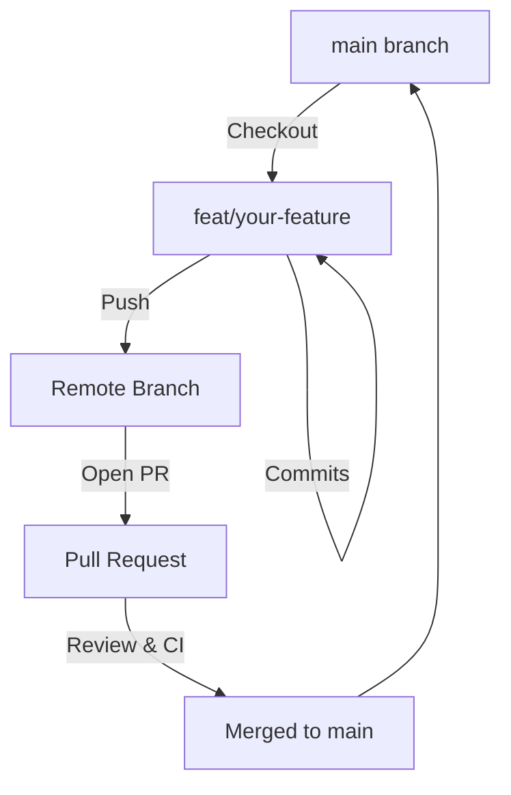

# Contributing to DukaPay

First off, thank you for considering contributing to DukaPay! It's people like you who make DukaPay a powerful tool for providing fair lending access to migrant workers worldwide.

This document provides a set of guidelines for contributing to DukaPay and its packages. These are mostly guidelines, not rules. Use your best judgment, and feel free to propose changes to this document in a pull request.

## 📋 Table of Contents

- [Code of Conduct](#code-of-conduct)
- [Development Workflow](#development-workflow)
- [Branching Strategy](#branching-strategy)
- [Commit Message Guidelines](#commit-message-guidelines)
- [Pull Request Standards](#pull-request-standards)
- [Environment Variables](#environment-variables)
- [Testing Requirements](#testing-requirements)
- [Style Guides](#style-guides)

## Code of Conduct

By participating in this project, you agree to maintain a respectful, inclusive, and harassment-free environment for everyone. We are committed to providing a welcoming experience for contributors of all backgrounds and skill levels. See [CODE_OF_CONDUCT.md](CODE_OF_CONDUCT.md).

## Community

Join the [DukaPay Telegram community](https://t.me/+eRqhka27TVo0NzM8) to discuss the project, ask questions, and coordinate with other contributors.

## Development Workflow

We follow a **Feature-Branch-to-Main** workflow. All development work should happen in feature branches and be merged into `main` via Pull Requests.

### Architecture & Contributor Wiki

If you're new to the codebase, start with:
- `docs/wiki/README.md` (high-level contributor wiki)
- `ARCHITECTURE.md` (system overview)
- `docs/deployed-contracts.md` (testnet/mainnet contract IDs and the env vars that consume them).



### Steps to Contribute

1. **Fork & Clone**: Fork the repository and clone it locally.
2. **Branch**: Create a new branch from the latest `main`.
3. **Develop**: Implement your changes, following code style and quality standards.
4. **Test**: Ensure all tests pass (see [Testing Requirements](#testing-requirements)).
5. **Commit**: Use [Conventional Commits](#commit-message-guidelines).
6. **Push & PR**: Push your branch and open a Pull Request against `main`.

## Branching Strategy

Follow these naming conventions for your branches:

| Type | Prefix | Example |
| :--- | :--- | :--- |
| **Feature** | `feat/` | `feat/lender-dashboard` |
| **Bug Fix** | `fix/` | `fix/nft-minting-error` |
| **Docs** | `docs/` | `docs/update-api-guide` |
| **Refactor** | `refactor/` | `refactor/loan-logic` |
| **Performance**| `perf/` | `perf/optimize-queries` |
| **Maintenance**| `chore/` | `chore/update-deps` |

## Commit Message Guidelines

We strictly follow the [Conventional Commits](https://www.conventionalcommits.org/) specification.

**Format**: `<type>(<scope>): <subject>`

### Common Types:

- **feat**: A new feature (corresponds to `MINOR` in Semantic Versioning).
- **fix**: A bug fix (corresponds to `PATCH` in Semantic Versioning).
- **docs**: Documentation only changes.
- **style**: Changes that do not affect the meaning of the code (white-space, formatting, etc).
- **refactor**: A code change that neither fixes a bug nor adds a feature.
- **perf**: A code change that improves performance.
- **test**: Adding missing tests or correcting existing tests.
- **chore**: Changes to the build process or auxiliary tools and libraries.

**Example**: `feat(contracts): add flash loan prevention to lending pool`

## Issue Title Prefixes

Every issue title **must** start with a bracketed component prefix so it is clear which part of DukaPay the work touches and so the issue can be mapped to a Drips Wave complexity tier. Choose the single most relevant prefix.

| Prefix | Scope | Example |
| :--- | :--- | :--- |
| `[backend]` | API routes, services, middleware, database logic | `[backend] Add loan repayment preview endpoint` |
| `[contracts]` | Soroban/Rust smart contracts, money policy | `[contracts] Implement settlement-netter contract` |
| `[frontend]` | Next.js/React UI, i18n, client-side flows | `[frontend] Serwist does not support Next.js Turbopack in dev` |
| `[sdk]` | TypeScript SDK package (`sdk/`) | `[sdk] Build TypeScript SDK package` |
| `[indexer]` | Event indexer tooling (`indexer/`, indexer services) | `[indexer] Standalone Rust event indexer` |
| `[scripts]` | Deploy, tooling, and load-test scripts (`scripts/`) | `[scripts] Add testnet deploy automation` |
| `[docs]` | Documentation, wiki, API docs, Swagger/OpenAPI alignment | `[docs] Swagger/OpenAPI alignment audit` |
| `[ci]` | CI/CD workflows, badges, supply-chain checks | `[ci] CI status badges` |
| `[infra]` | Docker, environment/config drift, deployment infrastructure | `[infra] Env drift sweep` |
| `[security]` | Secrets, PII crypto, signing, compliance, sanctions screening | `[security] PII key rotation (KEK/DEK)` |
| `[tests]` | Test suites, parity tests, E2E coverage, load-test baselines | `[tests] Money-parity tests` |
| `[ops]` | Operations tooling, monitoring, admin dashboards | `[ops] Admin operations center` |
| `[product]` | Cross-cutting product flows spanning multiple components | `[product] Agent-to-agent float transfer flow` |

Issue templates in `.github/ISSUE_TEMPLATE/` include a **Component** selector to help pick the right prefix.

## Pull Request Standards

When opening a PR, ensure your description includes:
- **Linked Issue**: Close the relevant issue (e.g., `Closes #123`).
- **Description**: A clear summary of the changes.
- **Testing**: Evidence that the changes were tested.
- **Checklist**:
    - [ ] Code follows project style guides.
    - [ ] Tests have been added/updated and pass.
    - [ ] Documentation has been updated.
    - [ ] Commit messages follow standards.

## Environment Variables

Before setting up the project locally, review the full environment variable reference in [docs/ENVIRONMENT.md](docs/ENVIRONMENT.md). Each `.env.example` file contains a pointer to this canonical reference. If you add a new environment variable, update both the relevant `.env.example` and the table in `ENVIRONMENT.md`.

## Testing Requirements

Before submitting, verify your changes by running:

### Frontend (Next.js/React)
```bash
cd frontend
npm run lint
npm run test
```

### Backend (Node/Express)
```bash
cd backend
npm run lint
npm run test
```

### Contracts (Soroban/Rust)
```bash
cd contracts
cargo fmt --check
cargo clippy
cargo test
```

### Smart Contracts Fuzzing (Soroban)
For consensus-critical changes to smart contracts, fuzz testing is an expected part of the workflow.

Refer to [`contracts/FUZZING_README.md`](contracts/FUZZING_README.md) for full setup instructions, invariant definitions, and running fuzz campaign scripts (`./fuzz_campaign.sh`).

## Style Guides

- **TypeScript**: Use functional components and hooks. Prefer `interface` over `type`. Ensure strict typing.
- **Rust**: Follow standard Rust naming conventions and maintain idiomatic code.

## Secure Development

For changes to authentication, authorization, payments, smart contracts, PII,
secrets, dependencies, or deployment boundaries:

- Copy `.github/THREAT_MODEL.md`, complete the STRIDE analysis, and attach it to the PR.
- Request review from a security champion using `.github/SECURITY_CHAMPIONS.md`.
- Run the repository pre-commit hooks before pushing (`pre-commit run --all-files`).
- Treat all security-gate failures as blocking until the finding is fixed or explicitly reviewed.

### Approved Database Query Patterns (Issue #406)

All database queries **must** use parameterized placeholders (`$1`, `$2`, …).
The following patterns are approved; anything else requires a security review.

**Static query (preferred):**
```typescript
await query('SELECT * FROM users WHERE id = $1', [userId]);
```

**Dynamic column names — use a whitelist:**
```typescript
const ALLOWED = new Set(['display_name', 'email']);
const fields = Object.keys(data).filter((k) => ALLOWED.has(k));
const setClauses = fields.map((f, i) => `${f} = $${i + 2}`).join(', ');
await query(`UPDATE users SET ${setClauses} WHERE id = $1`, [id, ...values]);
```

**Never** concatenate user input into SQL strings, table names, or column names.
The `pg` library parameterizes values but not identifiers — column/table names
must come from static whitelists, never from request bodies or query parameters.

### Approved Error Response Patterns (Issue #409)

Error responses sent to clients must never include:
- Stack traces (except when `NODE_ENV=development` and `EXPOSE_STACK_TRACES=true`)
- Internal file paths or directory structure
- Database schema details (table/column names, constraint names)
- PII (emails, phone numbers, wallet secret keys)
- Internal service names or infrastructure details

Server-side logs **should** include full error context with a correlation ID
(`req.requestId`) for debugging. Production errors are logged at `error` level
with the request ID, path, and method — the client receives only a generic
message and an error code.

### Secret Management (Issue #408)

All secrets **must** be provided via environment variables, validated at startup
by `backend/src/config/env.ts`. Never commit secrets to source control.

**Rules:**
- Use `process.env.SECRET_NAME` — never hardcode API keys, passwords, or tokens
- Add any new required env vars to `REQUIRED_ENV_VARS` in `backend/src/config/env.ts`
- Document new env vars in `docs/ENVIRONMENT.md` and the relevant `.env.example`
- Rotate any secret that was ever committed to git history
- Run `gitleaks detect --source .` locally before pushing to catch accidental leaks
- The CI pipeline (`security-gates.yml`) runs Gitleaks on every PR and weekly

**What counts as a secret:**
- API keys, JWT signing keys, webhook signing secrets
- Database passwords, Redis passwords
- Stellar secret keys (including `*_ADMIN_SECRET` env vars)
- Encryption keys (KEK/DEK for PII crypto)
- Any credential that grants access to an external service

**Allowed in source:**
- Placeholders in `.env.example` (use `your-xxx-here` format)
- Test fixtures with clearly fake values (e.g. `test-secret-key-for-unit-tests`)

---
Thank you for contributing to DukaPay! 🚀
