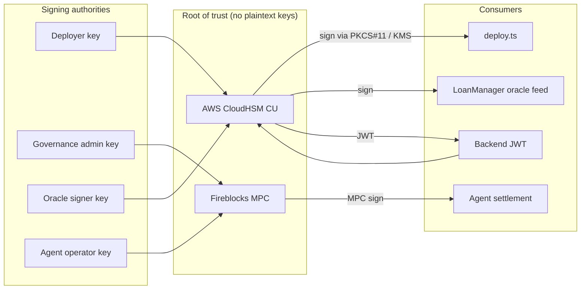

# Secure Key Management

DukaPay signs three classes of on-chain / off-chain actions. This document
describes how those keys are stored, rotated, and revoked, and how the protocol
moves **off environment variables and into an HSM or MPC**.

> Status: this document specifies the target architecture and the operational
> procedures. The provider-integration layer in
> [`scripts/key-management/`](../../scripts/key-management/) is a provider-agnostic
> scaffold; wire it to your chosen backend (AWS CloudHSM, Fireblocks, or an
> equivalent KMS/MPC) before mainnet key ceremonies.

## Key inventory

| Key | Used for | Store | Rotation |
| --- | --- | --- | --- |
| **Deployer** | Uploads / upgrades contract Wasm | HSM (CloudHSM CU) or MPC (Fireblocks) | 90 days |
| **Admin** (governance) | `MultisigGovernance` admin transfer, contract `set_admin` | MPC (3-of-5) | 180 days |
| **Oracle signer** | Rate oracle attestations consumed by `LoanManager` | HSM / KMS | 30 days |
| **Agent operator** | `AgentVault` `mint_float` / `settle_net` | MPC | 180 days |
| **Backend session** | JWT signing (`JWT_SECRET`) | KMS / secret manager | 30 days |

**No private key material ever lives in `.env`, CI variables, or source.**
Only opaque key **references** (e.g. `arn:aws:cloudhsm:...:key/deployer` or a
Fireblocks vault/key ID) are permitted in configuration.

## Architecture



## Provider integration

`scripts/key-management/provider.ts` defines a `SigningProvider` interface:

```ts
interface SigningProvider {
  /** Opaque reference to the key (never the key bytes). */
  readonly keyRef: string;
  /** Sign `payload` using the HSM/MPC; returns a detached signature. */
  sign(payload: Buffer): Promise<Buffer>;
  /** Returns the public key / address derived from the key reference. */
  publicKey(): Promise<string>;
  /** Rotate: provision a new key version and return its reference. */
  rotate(): Promise<string>;
}
```

Two implementations are scaffolded:

- `CloudHsmProvider` — talks to AWS CloudHSM via the PKCS#11 / KMS sign API.
- `FireblocksProvider` — talks to the Fireblocks MPC API (transaction + raw
  signing).

Both take a **key reference** from the environment (e.g.
`DUKAPAY_DEPLOYER_KEYREF`) and never the key material. Switching providers is a
config change only.

## Rotation schedules

| Key | Cadence | Automated? | Procedure |
| --- | --- | --- | --- |
| Deployer | 90 d | Yes | `scripts/key-management/rotate-key.sh deployer` |
| Governance admin | 180 d | Yes | rotate + re-submit `MultisigGovernance` signer set |
| Oracle signer | 30 d | Yes | `rotate-key.sh oracle` + push new pubkey to oracle feed |
| Agent operator | 180 d | Yes | rotate + `AgentVault` re-auth |
| JWT | 30 d | Yes | KMS automatic; backend re-reads on rollover |

Rotation is **non-disruptive**: the new key version is provisioned, its public
key is registered, a grace overlap period allows both versions to sign, then
the old version is disabled. Old key material is **cryptographically
destroyed** in the HSM (zeroization) and never exported.

## Key ceremony

See [`scripts/key-management/key-ceremony.md`](../../scripts/key-management/key-ceremony.md)
for the full multi-party procedure used to provision the genesis governance
admin key (3-of-5) and the deployer key. It requires:

- ≥ 3 independent operators in the room (or on a quorum call),
- a recorded, audited session,
- generation **inside** the HSM/MPC (key never exists in plaintext),
- signed attestation artifacts committed to the repo's `ops/` directory.

## Emergency key revocation

When a key is suspected compromised:

1. **Immediate stop:** trip the `CircuitBreaker` (`pause_all`) to halt
   value movement across all contracts.
2. **Revoke:** run `scripts/key-management/emergency-revoke.sh <key-name>` to
   zeroize / disable the key version in the HSM/MPC.
3. **Rotate:** provision a fresh key (ceremony-lite), register its public key.
4. **Resume:** `propose_override` → `approve_override` (×3) → `execute_override`
   on the CircuitBreaker once the replacement key is live.

The full runbook is in
[`scripts/key-management/emergency-revoke.sh`](../../scripts/key-management/emergency-revoke.sh)
(with accompanying docs).

## Pre-commit / CI secret scan

`scripts/key-management/scan-secrets.sh` is the canonical "no hardcoded secrets"
guard. It runs in pre-commit and CI. It fails on:

- high-entropy strings assigned to `secret` / `private_key` / `mnemonic` /
  `password` patterns,
- any literal that looks like a Stellar secret seed (`S…`, 56 chars),
- obvious test fixtures are allow-listed via `.secrets.allow`.

Run locally:

```bash
./scripts/key-management/scan-secrets.sh
```

## Definition-of-Done checklist

- [ ] All signing keys referenced via HSM/MPC, no key bytes in source or `.env`
- [ ] Rotation schedules automated (deployer 90d / admin 180d / oracle 30d)
- [ ] Key ceremony documented and attested
- [ ] Emergency revocation procedure tested
- [ ] `scan-secrets.sh` clean in CI
