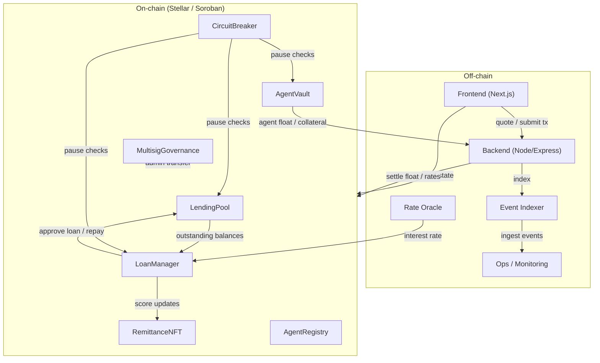
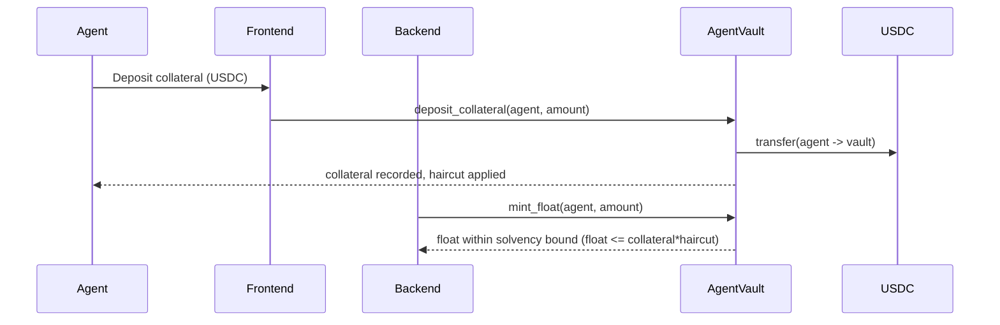
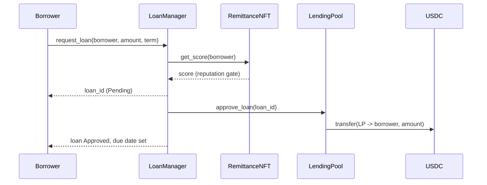
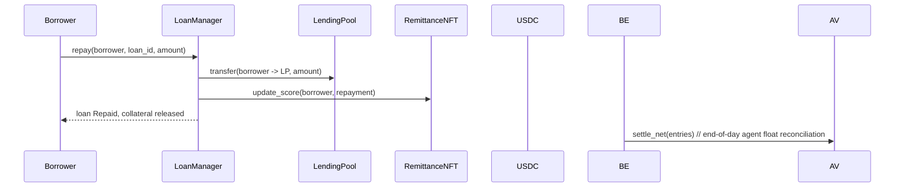

# DukaPay Architecture

This page is the entry point for the **Contributor Wiki**. It explains how the
system fits together, the key data flows, how to deploy it, how to troubleshoot
common problems, and how to onboard as a new contributor.

- [System Architecture](#system-architecture)
- [Data Flows](#data-flows)
- [Deployment Runbooks](deployment.md)
- [Troubleshooting](troubleshooting.md)
- [Contributor Onboarding](onboarding.md)

---

## System Architecture

DukaPay is a stablecoin lending and remittance protocol for migrant workers. It
is composed of a TypeScript/Next.js **frontend**, a Node/Express **backend**
(oracle, settlement, indexing), and a set of **Soroban (Rust) smart
contracts** that hold the on-chain state and enforce the core financial
invariants.

### Contract responsibilities

| Contract | Responsibility |
| --- | --- |
| `LendingPool` | Holds lender liquidity, mints/burns LP shares, realizes yield. |
| `AgentVault` | Holds each agent's USDC collateral and float (stablecoin credit). |
| `LoanManager` | Originates, approves, repays, liquidates loans; consumes rate oracle. |
| `RemittanceNFT` | Reputation score (on-time repayment, defaults). |
| `AgentRegistry` | On/off-boarding of settlement agents. |
| `MultisigGovernance` | 3-of-5 admin transfer with timelock. |
| `CircuitBreaker` | Global / contract / function pause with 3-of-5 override + 72h auto-expiry. |

---

## Data Flows

### 1. Cash-in (agent funds float)

### 2. Loan origination & approval

### 3. Repayment & settlement

### 4. Emergency pause (CircuitBreaker)

Any governance signer may trip a global / contract / function pause. The
guarded contracts (`LendingPool`, `AgentVault`, `LoanManager`) reject
value-moving calls while a pause is active. Lifting a pause requires a 3-of-5
governance override that waits out a timelock, and every pause auto-expires
after 72 hours so funds are never permanently frozen.

---

See [Deployment Runbooks](deployment.md), [Troubleshooting](troubleshooting.md),
and [Contributor Onboarding](onboarding.md) for operational detail.
